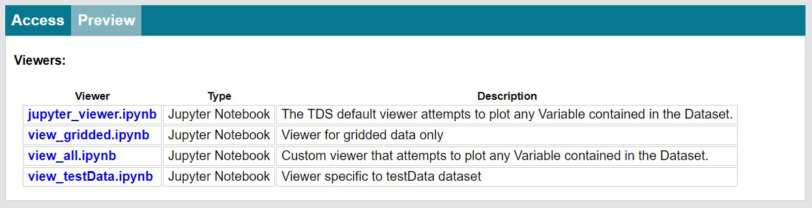
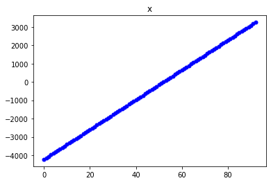
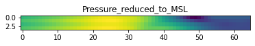

## The THREDDS Data Server Jupyter Notebook Service

#### GSA2020 Virtual Data Help Desk
___

**About:** The Jupyter Notebook service is a tool included in the [THREDDS Data Server](https://www.unidata.ucar.edu/software/tds/) (TDS) to improve access to datasets and help users explore and visualize the data.

**How it works:**  The Jupyter Notebook service provides TDS end users access Notebook viewers for each dataset in the TDS (provided any viewers exist for the dataset). Notebook viewers are [Jupyter Notebook](https://jupyter-notebook.readthedocs.io/en/stable/notebook.html) files that use [Siphon](https://unidata.github.io/siphon/latest/api/index.html) to access the given dataset and attempt to display the included data. Users can run, edit, and extend the Notebook viewers as an introduction to accessing and interacting with the dataset.

**Availability:** The Jupyter Notebook service is included in TDS v.5.0 and available to end users unless disabled by the TDS administrators. For a working example, visit the [Unidata THREDDS test catalog](https://thredds-test.unidata.ucar.edu/).
___

### Accessing Notebook data viewers
#### Web browser access
When browsing a THREDDS catalog online, all available Notebook viewers will appear on the `Dataset` page under the `Preview` tab and can be download via the provided link.

#### Code access
For clients accessing the Jupyter Notebook service through code (e.g. a script or application), two public endpoints are available:
* Get all valid viewers for a dataset: {hostURL}/thredds/notebook/{datasetID}?catalog={catalogURL}
    * e.g. https://mysite.edu/thredds/notebook/mydataset?catalog=catalog.xml
* Download a selected viewer by name: {hostURL}/thredds/notebook/{datasetID}?catalog={catalogURL}&filename={filename}
    * e.g. https://mysite.edu/thredds/notebook/mydataset?catalog=catalog.xml&filename=jupyter_viewer.ipynb
___

### Viewer example
The downloaded viewer will fill in the catalog URL and dataset name for the user to remotely access the dataset via Siphon.


```python
catalog = TDSCatalog(catUrl)
ds = catalog.datasets[datasetName]
dataset = ds.remote_access()
```

In this example, the viewer builds an interactive widget of the datasets variables, and attempts to plot any variable selected.


```python
var_name = widgets.RadioButtons(
    options=list(dataset.variables),
    description='Variable:')
display(var_name)
```


    RadioButtons(description='Variable:', options=('Pressure', 'time', 'y', 'x', 'Lambert_Conformal', 'Pressure_re…


Running the next cell with the variable "x" selected might look like this:


```python
plot(dataset.variables[var_name.value])
```





Whereas running the same cell with "Pressure_reduced_to_MSL" might look like this:


```python
plot(dataset.variables[var_name.value])
```

    Too many dimensions - reducing last 1 dimensions.
    New shape: [ 4 65  1]
    





Notebook viewers provide an easier way to get started working with datasets in the TDS>
___


**Questions? Ideas?** Contact: *support-thredds@unidata.ucar.edu*  
